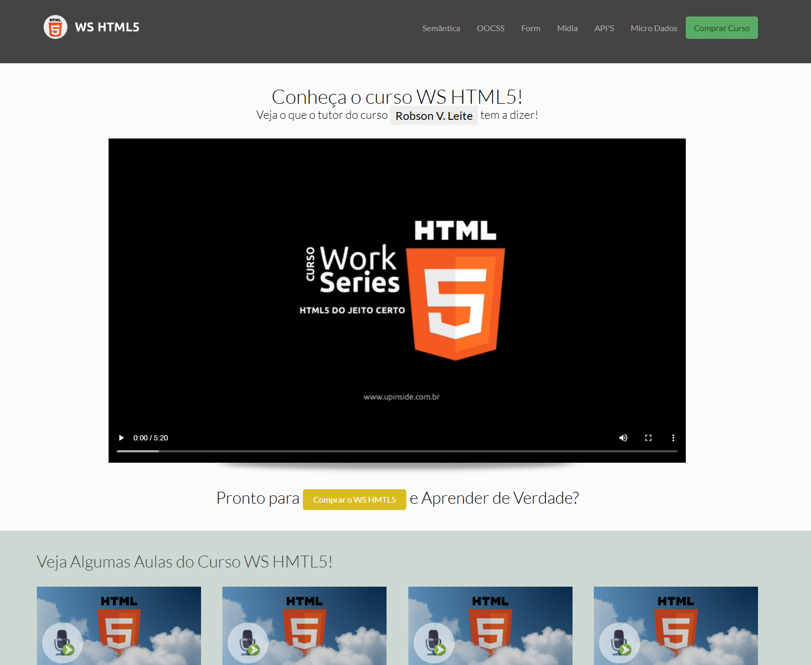

# Projeto de Semântica HTML5

 
Este projeto foi desenvolvido com o objetivo de relembrar e praticar a semântica do HTML5. Ele abrange o uso de várias tags semânticas para melhorar a estrutura, acessibilidade e SEO das páginas web.

## Objetivos do Projeto

- Revisar e aplicar as principais tags semânticas do HTML5.
- Demonstrar boas práticas de estruturação de conteúdo web.
- Melhorar a acessibilidade e a indexação das páginas por motores de busca.

## Tecnologias Utilizadas

- HTML5
- CSS3
- JavaScript

## Como Usar

1. Clone este repositório.
2. Abra o arquivo `index.html` em seu navegador.
3. Explore as páginas e observe o uso das tags semânticas.

## Contribuições Contribuições são bem-vindas! Sinta-se à vontade para abrir issues ou enviar pull requests com melhorias e sugestões.
